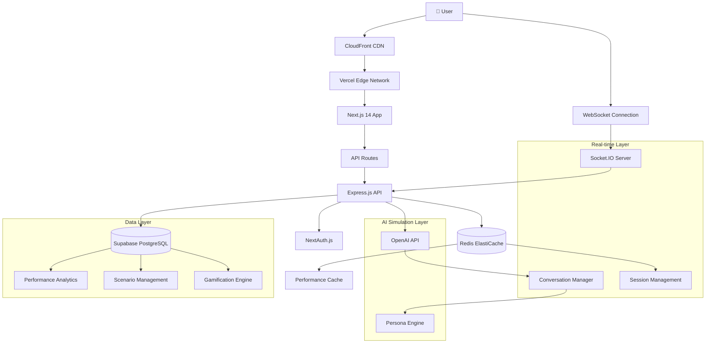
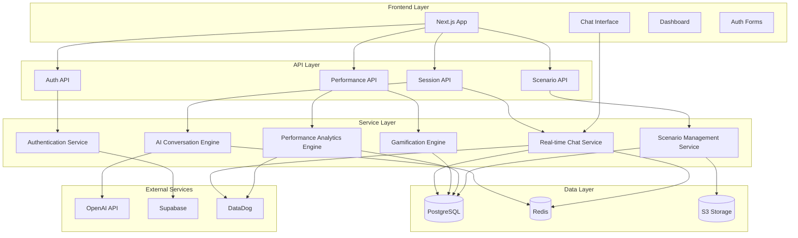
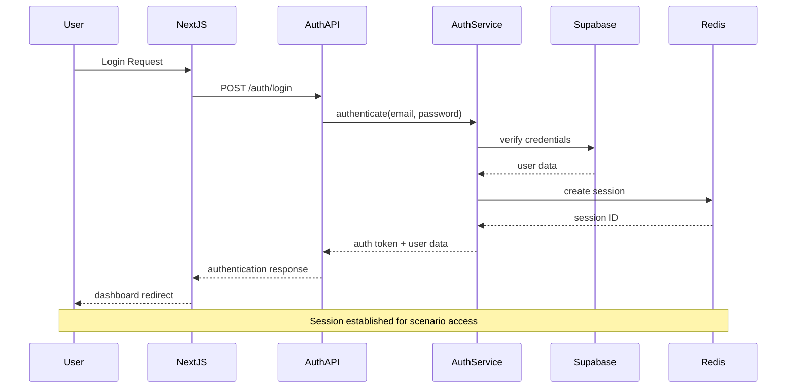
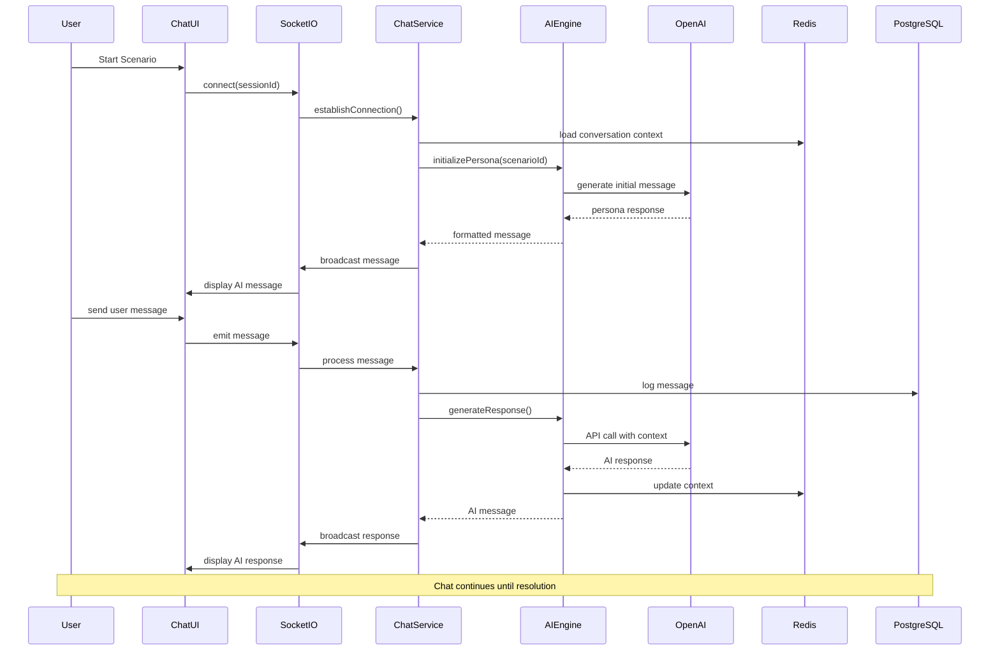
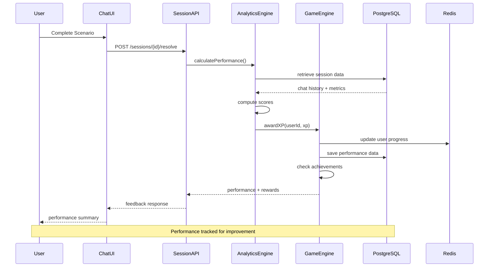
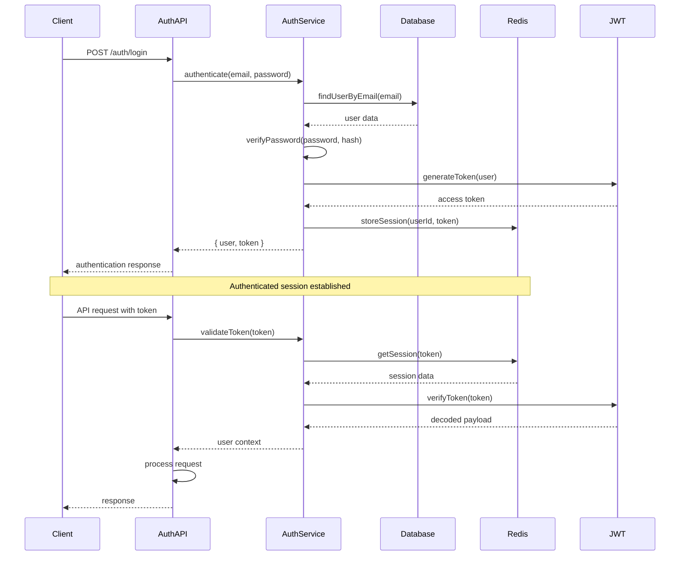

# IT Helpdesk Simulator Fullstack Architecture Document

## Introduction

This document outlines the complete fullstack architecture for the IT Helpdesk Simulator, including both backend systems and frontend implementation. It serves as the single source of truth for AI-driven development, ensuring consistency across the entire technology stack while supporting the core learning loop: receive ticket → chat with customer → verify identity → research → resolve/escalate → receive feedback → gain XP → level up.

This unified approach combines backend services for AI conversation management, real-time chat, and performance analytics with a professional frontend that replicates authentic helpdesk software experiences.

## Starter Template or Existing Project

**N/A - Greenfield Project**

This is a new project built from scratch with no existing codebase dependencies. We will use modern fullstack starter patterns but build custom solutions optimized for educational simulation and real-time chat performance.

## Change Log

| Date       | Version | Description                                              | Author             |
| ---------- | ------- | -------------------------------------------------------- | ------------------ |
| 2024-12-19 | 1.0     | Initial fullstack architecture for IT Helpdesk Simulator | Solution Architect |

## High Level Architecture

### Technical Summary

The IT Helpdesk Simulator employs a modern fullstack architecture built on a Jamstack + Real-time Services foundation using Next.js 14+ with App Router for the frontend and Express.js with Socket.IO for real-time backend services. The system integrates OpenAI's API for AI-powered customer simulation while maintaining conversation context and performance tracking in PostgreSQL with Redis caching.

The architecture supports 10,000+ concurrent users through horizontal scaling on Vercel/AWS with managed database services from Supabase. Security is implemented through NextAuth.js with SOC 2 compliance, while the gamification system tracks detailed performance metrics across five key competency areas. The monorepo structure using Turborepo enables efficient development while maintaining clear separation between frontend presentation, backend services, shared utilities, and AI simulation logic.

### Platform and Infrastructure Choice

**Platform:** Vercel + Supabase + AWS (Hybrid Cloud)

**Key Services:**

- **Vercel:** Frontend hosting, serverless functions, edge optimization
- **Supabase:** Managed PostgreSQL, real-time subscriptions, authentication
- **AWS:** Redis ElastiCache, S3 storage, CloudFront CDN
- **OpenAI:** GPT-4 API for customer simulation
- **Socket.IO:** Real-time chat infrastructure

**Deployment Host and Regions:** Multi-region deployment with primary in Sydney (Australia), secondary in Singapore (Asia-Pacific), and US East (global reach)

**Rationale:** This hybrid approach provides optimal performance for Australian users while maintaining global scalability. Vercel offers excellent Next.js optimization, Supabase provides managed PostgreSQL with real-time capabilities, and AWS fills gaps for caching and content delivery.

## Repository Structure

**Structure:** Monorepo with Turborepo  
**Monorepo Tool:** Turborepo 1.10+  
**Package Organization:** Feature-based packages with shared utilities

**Rationale:** The monorepo structure enables efficient code sharing between frontend and backend while maintaining clear boundaries. Turborepo provides optimal build caching and development experience. This structure supports the complex data flow between AI simulation, real-time chat, and performance tracking systems.

## Architecture Diagram



## Architectural Patterns

- **Jamstack Architecture:** Static site generation with serverless APIs and real-time services - _Rationale: Optimal performance and scalability for educational content with dynamic real-time interactions_

- **Event-Driven Communication:** WebSocket events for real-time chat with message queuing - _Rationale: Enables authentic conversational experience with reliable message delivery_

- **Repository Pattern:** Abstract data access logic with transaction management - _Rationale: Enables testing and supports complex performance analytics queries_

- **Command Query Responsibility Segregation (CQRS):** Separate read/write paths for performance data - _Rationale: Optimizes real-time chat performance while supporting complex analytics_

- **Circuit Breaker Pattern:** Resilient AI API integration with fallback responses - _Rationale: Ensures system stability when AI services are unavailable_

- **Pub/Sub Pattern:** Real-time performance updates and achievement notifications - _Rationale: Supports gamification features and real-time feedback systems_

## Tech Stack

### Technology Stack Table

| Category                | Technology             | Version    | Purpose                            | Rationale                                                                         |
| ----------------------- | ---------------------- | ---------- | ---------------------------------- | --------------------------------------------------------------------------------- |
| Frontend Language       | TypeScript             | 5.3+       | Type-safe frontend development     | Ensures code quality and developer productivity for complex state management      |
| Frontend Framework      | Next.js                | 14.2+      | React-based fullstack framework    | Optimal performance with App Router, built-in API routes, and Vercel optimization |
| UI Component Library    | shadcn/ui              | 0.8+       | Professional component system      | Provides consistent, accessible components with professional styling              |
| State Management        | Zustand                | 4.4+       | Lightweight state management       | Perfect for real-time chat state and user progress tracking                       |
| Backend Language        | Node.js                | 20.11+ LTS | JavaScript runtime                 | Enables shared types and utilities between frontend and backend                   |
| Backend Framework       | Express.js             | 4.18+      | Web application framework          | Mature, well-documented solution for API and WebSocket management                 |
| API Style               | REST + WebSocket       | -          | Hybrid communication               | REST for standard operations, WebSocket for real-time chat                        |
| Database                | PostgreSQL             | 15+        | Relational database                | Supports complex queries for analytics and ACID compliance for user data          |
| Cache                   | Redis                  | 7.0+       | In-memory caching                  | Essential for session management and real-time chat performance                   |
| File Storage            | AWS S3                 | -          | Object storage                     | Scenario assets, user uploads, and static content                                 |
| Authentication          | NextAuth.js            | 4.24+      | Authentication framework           | Comprehensive auth solution with session management                               |
| AI Service              | OpenAI API             | GPT-4      | Customer simulation                | Most capable language model for realistic conversation simulation                 |
| Frontend Testing        | Jest + Testing Library | 29.7+      | Unit and integration testing       | Industry standard for React component testing                                     |
| Backend Testing         | Jest + Supertest       | 29.7+      | API testing                        | Comprehensive testing for Express.js APIs                                         |
| E2E Testing             | Playwright             | 1.40+      | End-to-end testing                 | Reliable testing for complex user flows with real-time features                   |
| Build Tool              | Turborepo              | 1.10+      | Monorepo build orchestration       | Optimized builds with intelligent caching                                         |
| Bundler                 | Webpack                | 5.89+      | Module bundling                    | Built into Next.js with custom optimizations                                      |
| Real-time Communication | Socket.IO              | 4.7+       | WebSocket management               | Reliable real-time communication with fallback support                            |
| CI/CD                   | GitHub Actions         | -          | Automated deployment               | Integrated with Vercel and supports comprehensive testing                         |
| Monitoring              | DataDog                | -          | Application performance monitoring | Comprehensive observability for real-time and AI services                         |
| Logging                 | Winston                | 3.11+      | Structured logging                 | Professional logging with multiple transport options                              |
| CSS Framework           | Tailwind CSS           | 3.3+       | Utility-first CSS                  | Rapid development with consistent professional styling                            |

## Data Models

### User Model

**Purpose:** Represents system users with authentication, progress tracking, and performance history

**Key Attributes:**

- `id`: UUID - Primary identifier
- `email`: String - Authentication and communication
- `passwordHash`: String - Secure password storage
- `profile`: Object - Name, preferences, and settings
- `level`: Integer - Current gamification level
- `xp`: Integer - Total experience points earned
- `createdAt`: DateTime - Account creation timestamp
- `lastLoginAt`: DateTime - Last authentication time

**TypeScript Interface:**

```typescript
interface User {
  id: string;
  email: string;
  passwordHash: string;
  profile: {
    firstName: string;
    lastName: string;
    timezone: string;
    preferences: UserPreferences;
  };
  level: number;
  xp: number;
  createdAt: Date;
  lastLoginAt: Date;
  // Navigation properties
  sessions: UserSession[];
  achievements: UserAchievement[];
  performanceMetrics: PerformanceMetric[];
}
```

**Relationships:**

- One-to-many with UserSession (chat sessions)
- One-to-many with UserAchievement (earned achievements)
- One-to-many with PerformanceMetric (performance history)

### Scenario Model

**Purpose:** Defines learning scenarios with complete context, personas, and assessment criteria

**Key Attributes:**

- `id`: UUID - Primary identifier
- `title`: String - Scenario display name
- `description`: String - Scenario overview
- `difficulty`: Enum - Starter, Intermediate, Advanced
- `estimatedTime`: Integer - Expected completion time in minutes
- `xpReward`: Integer - XP points for completion
- `ticketTemplate`: Object - Ticket structure and content
- `customerPersona`: Object - AI persona definition
- `knowledgeBaseEntries`: Array - Curated search results
- `assessmentCriteria`: Object - Scoring rubric

**TypeScript Interface:**

```typescript
interface Scenario {
  id: string;
  title: string;
  description: string;
  difficulty: 'starter' | 'intermediate' | 'advanced';
  estimatedTime: number;
  xpReward: number;
  ticketTemplate: {
    priority: 'low' | 'medium' | 'high';
    category: string;
    description: string;
    customerInfo: CustomerInfo;
    technicalContext: TechnicalContext;
  };
  customerPersona: {
    name: string;
    personality: PersonalityTraits;
    technicalLevel: 'novice' | 'intermediate' | 'advanced';
    communicationStyle: CommunicationStyle;
  };
  knowledgeBaseEntries: KnowledgeBaseEntry[];
  assessmentCriteria: AssessmentCriteria;
  prerequisites: string[];
  createdAt: Date;
  updatedAt: Date;
}
```

**Relationships:**

- One-to-many with UserSession (scenario instances)
- Many-to-many with prerequisite scenarios

### UserSession Model

**Purpose:** Tracks individual user interactions with scenarios including chat history and performance data

**Key Attributes:**

- `id`: UUID - Primary identifier
- `userId`: UUID - Associated user
- `scenarioId`: UUID - Associated scenario
- `status`: Enum - Active, Completed, Abandoned
- `startedAt`: DateTime - Session start time
- `completedAt`: DateTime - Session completion time
- `chatHistory`: Array - Complete conversation log
- `performanceData`: Object - Real-time performance metrics
- `verificationStatus`: Object - Identity verification progress
- `resolutionData`: Object - Final resolution and documentation

**TypeScript Interface:**

```typescript
interface UserSession {
  id: string;
  userId: string;
  scenarioId: string;
  status: 'active' | 'completed' | 'abandoned';
  startedAt: Date;
  completedAt?: Date;
  chatHistory: ChatMessage[];
  performanceData: {
    responseTime: number[];
    verificationScore: number;
    communicationScore: number;
    technicalScore: number;
    researchScore: number;
  };
  verificationStatus: {
    nameVerified: boolean;
    usernameVerified: boolean;
    assetTagVerified: boolean;
  };
  resolutionData?: {
    resolutionType: 'resolved' | 'escalated';
    documentation: string;
    customerSatisfaction: number;
  };
}
```

**Relationships:**

- Many-to-one with User
- Many-to-one with Scenario
- One-to-many with ChatMessage

## API Specification

### REST API Specification

```yaml
openapi: 3.0.0
info:
  title: IT Helpdesk Simulator API
  version: 1.0.0
  description: Comprehensive API for IT Helpdesk Simulator platform
servers:
  - url: https://api.helpdesksimu.com/v1
    description: Production API
  - url: https://staging-api.helpdesksimu.com/v1
    description: Staging API

paths:
  /auth/login:
    post:
      summary: User authentication
      requestBody:
        required: true
        content:
          application/json:
            schema:
              type: object
              properties:
                email:
                  type: string
                  format: email
                password:
                  type: string
                  minLength: 8
      responses:
        '200':
          description: Successful authentication
          content:
            application/json:
              schema:
                type: object
                properties:
                  user:
                    $ref: '#/components/schemas/User'
                  token:
                    type: string
                  expiresAt:
                    type: string
                    format: date-time

  /scenarios:
    get:
      summary: Get available scenarios
      parameters:
        - name: difficulty
          in: query
          schema:
            type: string
            enum: [starter, intermediate, advanced]
        - name: completed
          in: query
          schema:
            type: boolean
      responses:
        '200':
          description: List of scenarios
          content:
            application/json:
              schema:
                type: array
                items:
                  $ref: '#/components/schemas/Scenario'

  /scenarios/{scenarioId}/start:
    post:
      summary: Start a new scenario session
      parameters:
        - name: scenarioId
          in: path
          required: true
          schema:
            type: string
            format: uuid
      responses:
        '201':
          description: Session created
          content:
            application/json:
              schema:
                $ref: '#/components/schemas/UserSession'

  /sessions/{sessionId}/messages:
    post:
      summary: Send message in chat session
      parameters:
        - name: sessionId
          in: path
          required: true
          schema:
            type: string
            format: uuid
      requestBody:
        required: true
        content:
          application/json:
            schema:
              type: object
              properties:
                message:
                  type: string
                  maxLength: 1000
                messageType:
                  type: string
                  enum: [user, system, verification]
      responses:
        '201':
          description: Message sent
          content:
            application/json:
              schema:
                $ref: '#/components/schemas/ChatMessage'

  /sessions/{sessionId}/resolve:
    post:
      summary: Resolve or escalate session
      parameters:
        - name: sessionId
          in: path
          required: true
          schema:
            type: string
            format: uuid
      requestBody:
        required: true
        content:
          application/json:
            schema:
              type: object
              properties:
                resolutionType:
                  type: string
                  enum: [resolved, escalated]
                documentation:
                  type: string
                  maxLength: 2000
                escalationReason:
                  type: string
                  maxLength: 500
      responses:
        '200':
          description: Session resolved
          content:
            application/json:
              schema:
                $ref: '#/components/schemas/SessionResolution'

  /users/me/performance:
    get:
      summary: Get user performance metrics
      parameters:
        - name: timeframe
          in: query
          schema:
            type: string
            enum: [week, month, all]
        - name: dimension
          in: query
          schema:
            type: string
            enum: [technical, communication, verification, efficiency]
      responses:
        '200':
          description: Performance metrics
          content:
            application/json:
              schema:
                $ref: '#/components/schemas/PerformanceMetrics'

components:
  schemas:
    User:
      type: object
      properties:
        id:
          type: string
          format: uuid
        email:
          type: string
          format: email
        profile:
          $ref: '#/components/schemas/UserProfile'
        level:
          type: integer
          minimum: 1
        xp:
          type: integer
          minimum: 0
        createdAt:
          type: string
          format: date-time

    Scenario:
      type: object
      properties:
        id:
          type: string
          format: uuid
        title:
          type: string
        description:
          type: string
        difficulty:
          type: string
          enum: [starter, intermediate, advanced]
        estimatedTime:
          type: integer
        xpReward:
          type: integer
        prerequisites:
          type: array
          items:
            type: string
            format: uuid

    UserSession:
      type: object
      properties:
        id:
          type: string
          format: uuid
        userId:
          type: string
          format: uuid
        scenarioId:
          type: string
          format: uuid
        status:
          type: string
          enum: [active, completed, abandoned]
        startedAt:
          type: string
          format: date-time
        completedAt:
          type: string
          format: date-time
        performanceData:
          $ref: '#/components/schemas/PerformanceData'
```

## Components

### Authentication Service

**Responsibility:** Handles user authentication, session management, and security protocols

**Key Interfaces:**

- `POST /auth/login` - User authentication with email/password
- `POST /auth/register` - New user registration with email verification
- `POST /auth/logout` - Session termination and cleanup
- `POST /auth/refresh` - JWT token refresh
- `POST /auth/reset-password` - Password reset flow

**Dependencies:** NextAuth.js, Supabase Auth, Redis session store

**Technology Stack:** NextAuth.js 4.24+ with Supabase adapter, Redis for session storage, bcrypt for password hashing

### AI Conversation Engine

**Responsibility:** Manages AI-powered customer simulation with persona consistency and conversation context

**Key Interfaces:**

- `generateResponse(message, context, persona)` - Generate AI customer response
- `maintainPersona(sessionId, persona)` - Ensure persona consistency
- `updateConversationContext(sessionId, message)` - Update conversation state
- `handleVerificationRequest(sessionId, verificationType)` - Process verification attempts

**Dependencies:** OpenAI API, Conversation Context Manager, Persona Configuration

**Technology Stack:** OpenAI GPT-4 API, custom conversation management, Redis for conversation state

### Real-time Chat Service

**Responsibility:** Handles WebSocket connections, message delivery, and real-time communication

**Key Interfaces:**

- `establishConnection(userId, sessionId)` - Initialize WebSocket connection
- `sendMessage(sessionId, message)` - Deliver messages to connected clients
- `broadcastTypingIndicator(sessionId, isTyping)` - Manage typing indicators
- `handleDisconnection(connectionId)` - Clean up disconnected sessions

**Dependencies:** Socket.IO, Session Management, Message Queue

**Technology Stack:** Socket.IO 4.7+ with Redis adapter, message queuing for reliability

### Scenario Management Service

**Responsibility:** Loads, manages, and tracks user progress through learning scenarios

**Key Interfaces:**

- `loadScenario(scenarioId)` - Load scenario configuration
- `checkPrerequisites(userId, scenarioId)` - Validate scenario access
- `trackProgress(userId, scenarioId, progress)` - Update completion status
- `generateTicket(scenarioId, userId)` - Create scenario-specific ticket

**Dependencies:** Scenario Repository, User Progress Tracking, Ticket Generator

**Technology Stack:** PostgreSQL for scenario storage, JSON schema validation, caching layer

### Performance Analytics Engine

**Responsibility:** Calculates performance metrics, generates feedback, and tracks user improvement

**Key Interfaces:**

- `calculatePerformanceScore(sessionId, criteria)` - Compute multi-dimensional scores
- `generateFeedback(sessionId, performance)` - Create detailed feedback
- `trackImprovement(userId, timeframe)` - Analyze performance trends
- `generateReport(userId, format)` - Export performance data

**Dependencies:** Performance Calculator, Feedback Generator, Analytics Database

**Technology Stack:** PostgreSQL for metrics storage, analytics queries, report generation

### Gamification Engine

**Responsibility:** Manages XP, levels, achievements, and progress tracking

**Key Interfaces:**

- `awardXP(userId, amount, reason)` - Award experience points
- `checkLevelUp(userId)` - Process level advancement
- `unlockAchievement(userId, achievementId)` - Grant achievements
- `updateProgress(userId, activityType, value)` - Track progress metrics

**Dependencies:** User Progress Repository, Achievement Definitions, Level Calculator

**Technology Stack:** PostgreSQL for progress data, Redis for real-time updates, event system

## Components Diagram



## Core Workflows

### User Authentication and Session Start



### Real-time Chat Scenario Flow



### Performance Assessment and Gamification



## Database Schema

### Core Tables Structure

```sql
-- Users table with authentication and progress
CREATE TABLE users (
    id UUID PRIMARY KEY DEFAULT gen_random_uuid(),
    email VARCHAR(255) UNIQUE NOT NULL,
    password_hash VARCHAR(255) NOT NULL,
    first_name VARCHAR(100),
    last_name VARCHAR(100),
    level INTEGER DEFAULT 1,
    xp INTEGER DEFAULT 0,
    timezone VARCHAR(50) DEFAULT 'UTC',
    preferences JSONB DEFAULT '{}',
    created_at TIMESTAMP WITH TIME ZONE DEFAULT NOW(),
    updated_at TIMESTAMP WITH TIME ZONE DEFAULT NOW(),
    last_login_at TIMESTAMP WITH TIME ZONE
);

-- Scenarios table for learning content
CREATE TABLE scenarios (
    id UUID PRIMARY KEY DEFAULT gen_random_uuid(),
    title VARCHAR(255) NOT NULL,
    description TEXT,
    difficulty VARCHAR(20) CHECK (difficulty IN ('starter', 'intermediate', 'advanced')),
    estimated_time INTEGER NOT NULL,
    xp_reward INTEGER NOT NULL,
    ticket_template JSONB NOT NULL,
    customer_persona JSONB NOT NULL,
    knowledge_base_entries JSONB NOT NULL,
    assessment_criteria JSONB NOT NULL,
    prerequisites UUID[] DEFAULT '{}',
    is_active BOOLEAN DEFAULT true,
    created_at TIMESTAMP WITH TIME ZONE DEFAULT NOW(),
    updated_at TIMESTAMP WITH TIME ZONE DEFAULT NOW()
);

-- User sessions for tracking scenario interactions
CREATE TABLE user_sessions (
    id UUID PRIMARY KEY DEFAULT gen_random_uuid(),
    user_id UUID NOT NULL REFERENCES users(id) ON DELETE CASCADE,
    scenario_id UUID NOT NULL REFERENCES scenarios(id) ON DELETE CASCADE,
    status VARCHAR(20) DEFAULT 'active' CHECK (status IN ('active', 'completed', 'abandoned')),
    started_at TIMESTAMP WITH TIME ZONE DEFAULT NOW(),
    completed_at TIMESTAMP WITH TIME ZONE,
    chat_history JSONB DEFAULT '[]',
    performance_data JSONB DEFAULT '{}',
    verification_status JSONB DEFAULT '{}',
    resolution_data JSONB,
    session_duration INTEGER, -- in seconds
    created_at TIMESTAMP WITH TIME ZONE DEFAULT NOW(),
    updated_at TIMESTAMP WITH TIME ZONE DEFAULT NOW()
);

-- Chat messages for detailed conversation tracking
CREATE TABLE chat_messages (
    id UUID PRIMARY KEY DEFAULT gen_random_uuid(),
    session_id UUID NOT NULL REFERENCES user_sessions(id) ON DELETE CASCADE,
    sender_type VARCHAR(20) NOT NULL CHECK (sender_type IN ('user', 'ai', 'system')),
    message_content TEXT NOT NULL,
    message_type VARCHAR(50) DEFAULT 'chat',
    metadata JSONB DEFAULT '{}',
    created_at TIMESTAMP WITH TIME ZONE DEFAULT NOW()
);

-- Performance metrics for detailed analytics
CREATE TABLE performance_metrics (
    id UUID PRIMARY KEY DEFAULT gen_random_uuid(),
    user_id UUID NOT NULL REFERENCES users(id) ON DELETE CASCADE,
    session_id UUID NOT NULL REFERENCES user_sessions(id) ON DELETE CASCADE,
    scenario_id UUID NOT NULL REFERENCES scenarios(id) ON DELETE CASCADE,
    verification_score DECIMAL(5,2),
    communication_score DECIMAL(5,2),
    technical_score DECIMAL(5,2),
    documentation_score DECIMAL(5,2),
    response_time_score DECIMAL(5,2),
    overall_score DECIMAL(5,2),
    xp_earned INTEGER DEFAULT 0,
    completion_time INTEGER, -- in seconds
    created_at TIMESTAMP WITH TIME ZONE DEFAULT NOW()
);

-- Achievements for gamification
CREATE TABLE achievements (
    id UUID PRIMARY KEY DEFAULT gen_random_uuid(),
    title VARCHAR(255) NOT NULL,
    description TEXT,
    badge_icon VARCHAR(100),
    criteria JSONB NOT NULL,
    tier VARCHAR(20) DEFAULT 'bronze' CHECK (tier IN ('bronze', 'silver', 'gold', 'platinum')),
    is_active BOOLEAN DEFAULT true,
    created_at TIMESTAMP WITH TIME ZONE DEFAULT NOW()
);

-- User achievements for tracking earned badges
CREATE TABLE user_achievements (
    id UUID PRIMARY KEY DEFAULT gen_random_uuid(),
    user_id UUID NOT NULL REFERENCES users(id) ON DELETE CASCADE,
    achievement_id UUID NOT NULL REFERENCES achievements(id) ON DELETE CASCADE,
    earned_at TIMESTAMP WITH TIME ZONE DEFAULT NOW(),
    progress_data JSONB DEFAULT '{}',
    UNIQUE(user_id, achievement_id)
);

-- Indexes for performance optimization
CREATE INDEX idx_users_email ON users(email);
CREATE INDEX idx_users_level_xp ON users(level, xp);
CREATE INDEX idx_scenarios_difficulty ON scenarios(difficulty);
CREATE INDEX idx_user_sessions_user_id ON user_sessions(user_id);
CREATE INDEX idx_user_sessions_status ON user_sessions(status);
CREATE INDEX idx_chat_messages_session_id ON chat_messages(session_id);
CREATE INDEX idx_performance_metrics_user_id ON performance_metrics(user_id);
CREATE INDEX idx_performance_metrics_session_id ON performance_metrics(session_id);
CREATE INDEX idx_user_achievements_user_id ON user_achievements(user_id);
```

## Frontend Architecture

### Component Architecture

#### Component Organization

```
apps/web/src/
├── components/
│   ├── ui/                    # shadcn/ui base components
│   │   ├── button.tsx
│   │   ├── input.tsx
│   │   ├── dialog.tsx
│   │   └── progress.tsx
│   ├── auth/                  # Authentication components
│   │   ├── LoginForm.tsx
│   │   ├── RegisterForm.tsx
│   │   └── AuthProvider.tsx
│   ├── dashboard/             # Dashboard components
│   │   ├── DashboardLayout.tsx
│   │   ├── ProgressOverview.tsx
│   │   ├── RecentActivity.tsx
│   │   └── QuickActions.tsx
│   ├── chat/                  # Real-time chat components
│   │   ├── ChatInterface.tsx
│   │   ├── MessageBubble.tsx
│   │   ├── TypingIndicator.tsx
│   │   └── ChatInput.tsx
│   ├── scenarios/             # Scenario management
│   │   ├── ScenarioList.tsx
│   │   ├── ScenarioCard.tsx
│   │   ├── DifficultyBadge.tsx
│   │   └── ProgressLock.tsx
│   ├── tickets/               # Ticket interface
│   │   ├── TicketPanel.tsx
│   │   ├── CustomerInfo.tsx
│   │   ├── VerificationChecklist.tsx
│   │   └── ResolutionForm.tsx
│   ├── knowledge/             # Knowledge base search
│   │   ├── SearchInterface.tsx
│   │   ├── SearchResults.tsx
│   │   ├── CredibilityIndicator.tsx
│   │   └── SearchHistory.tsx
│   ├── performance/           # Performance tracking
│   │   ├── PerformanceSummary.tsx
│   │   ├── SkillBreakdown.tsx
│   │   ├── ProgressChart.tsx
│   │   └── FeedbackDisplay.tsx
│   └── gamification/          # Gamification elements
│       ├── XPProgress.tsx
│       ├── LevelBadge.tsx
│       ├── AchievementCard.tsx
│       └── LeaderboardEntry.tsx
├── hooks/                     # Custom React hooks
│   ├── useAuth.ts
│   ├── useSocket.ts
│   ├── useScenario.ts
│   ├── usePerformance.ts
│   └── useLocalStorage.ts
├── stores/                    # Zustand state management
│   ├── authStore.ts
│   ├── chatStore.ts
│   ├── scenarioStore.ts
│   └── performanceStore.ts
├── services/                  # API client services
│   ├── api.ts
│   ├── authService.ts
│   ├── scenarioService.ts
│   ├── chatService.ts
│   └── performanceService.ts
├── utils/                     # Utility functions
│   ├── formatters.ts
│   ├── validators.ts
│   ├── constants.ts
│   └── helpers.ts
└── app/                       # Next.js App Router pages
    ├── layout.tsx
    ├── page.tsx
    ├── login/
    ├── dashboard/
    ├── scenarios/
    ├── chat/
    └── performance/
```

#### Component Template

```typescript
'use client';

import { useState, useEffect } from 'react';
import { Card, CardContent, CardDescription, CardHeader, CardTitle } from '@/components/ui/card';
import { Button } from '@/components/ui/button';
import { useAuth } from '@/hooks/useAuth';
import { cn } from '@/lib/utils';

interface ComponentProps {
    className?: string;
    variant?: 'default' | 'minimal' | 'detailed';
    onAction?: (data: any) => void;
}

export function ComponentTemplate({
    className,
    variant = 'default',
    onAction
}: ComponentProps) {
    const { user } = useAuth();
    const [isLoading, setIsLoading] = useState(false);
    const [data, setData] = useState(null);

    useEffect(() => {
        // Component initialization logic
        initializeComponent();
    }, []);

    const initializeComponent = async () => {
        setIsLoading(true);
        try {
            // Async initialization logic
            const result = await fetchData();
            setData(result);
        } catch (error) {
            console.error('Component initialization error:', error);
        } finally {
            setIsLoading(false);
        }
    };

    const handleAction = (actionData: any) => {
        onAction?.(actionData);
    };

    if (isLoading) {
        return <div className="animate-pulse">Loading...</div>;
    }

    return (
        <Card className={cn('w-full', className)}>
            <CardHeader>
                <CardTitle>Component Title</CardTitle>
                <CardDescription>Component description</CardDescription>
            </CardHeader>
            <CardContent>
                {/* Component content */}
                <Button onClick={handleAction} variant="default">
                    Action Button
                </Button>
            </CardContent>
        </Card>
    );
}
```

### State Management Architecture

#### State Structure

```typescript
// stores/authStore.ts
import { create } from 'zustand';
import { persist } from 'zustand/middleware';

interface User {
  id: string;
  email: string;
  profile: {
    firstName: string;
    lastName: string;
    timezone: string;
  };
  level: number;
  xp: number;
}

interface AuthState {
  user: User | null;
  token: string | null;
  isLoading: boolean;
  isAuthenticated: boolean;
  // Actions
  login: (email: string, password: string) => Promise<void>;
  logout: () => void;
  refreshToken: () => Promise<void>;
  updateUser: (updates: Partial<User>) => void;
}

export const useAuthStore = create<AuthState>()(
  persist(
    (set, get) => ({
      user: null,
      token: null,
      isLoading: false,
      isAuthenticated: false,

      login: async (email: string, password: string) => {
        set({ isLoading: true });
        try {
          const response = await authService.login(email, password);
          set({
            user: response.user,
            token: response.token,
            isAuthenticated: true,
            isLoading: false,
          });
        } catch (error) {
          set({ isLoading: false });
          throw error;
        }
      },

      logout: () => {
        set({
          user: null,
          token: null,
          isAuthenticated: false,
        });
      },

      refreshToken: async () => {
        const { token } = get();
        if (!token) return;

        try {
          const response = await authService.refreshToken(token);
          set({ token: response.token });
        } catch (error) {
          get().logout();
        }
      },

      updateUser: (updates: Partial<User>) => {
        set((state) => ({
          user: state.user ? { ...state.user, ...updates } : null,
        }));
      },
    }),
    {
      name: 'auth-storage',
      partialize: (state) => ({
        user: state.user,
        token: state.token,
        isAuthenticated: state.isAuthenticated,
      }),
    }
  )
);

// stores/chatStore.ts
import { create } from 'zustand';
import { Socket } from 'socket.io-client';

interface ChatMessage {
  id: string;
  senderId: string;
  senderType: 'user' | 'ai' | 'system';
  content: string;
  timestamp: Date;
  metadata?: Record<string, any>;
}

interface ChatState {
  socket: Socket | null;
  sessionId: string | null;
  messages: ChatMessage[];
  isConnected: boolean;
  isTyping: boolean;
  customerPersona: any;
  // Actions
  initializeSocket: (sessionId: string) => void;
  sendMessage: (content: string) => void;
  addMessage: (message: ChatMessage) => void;
  setTyping: (isTyping: boolean) => void;
  clearMessages: () => void;
  disconnect: () => void;
}

export const useChatStore = create<ChatState>((set, get) => ({
  socket: null,
  sessionId: null,
  messages: [],
  isConnected: false,
  isTyping: false,
  customerPersona: null,

  initializeSocket: (sessionId: string) => {
    const socket = io('/chat', {
      auth: { sessionId },
    });

    socket.on('connect', () => {
      set({ isConnected: true });
    });

    socket.on('message', (message: ChatMessage) => {
      get().addMessage(message);
    });

    socket.on('typing', (isTyping: boolean) => {
      set({ isTyping });
    });

    set({ socket, sessionId });
  },

  sendMessage: (content: string) => {
    const { socket, sessionId } = get();
    if (!socket || !sessionId) return;

    const message: ChatMessage = {
      id: crypto.randomUUID(),
      senderId: 'user',
      senderType: 'user',
      content,
      timestamp: new Date(),
    };

    socket.emit('message', message);
    get().addMessage(message);
  },

  addMessage: (message: ChatMessage) => {
    set((state) => ({
      messages: [...state.messages, message],
    }));
  },

  setTyping: (isTyping: boolean) => {
    set({ isTyping });
  },

  clearMessages: () => {
    set({ messages: [] });
  },

  disconnect: () => {
    const { socket } = get();
    if (socket) {
      socket.disconnect();
    }
    set({
      socket: null,
      sessionId: null,
      isConnected: false,
      messages: [],
    });
  },
}));
```

### Routing Architecture

#### Route Organization

```
app/
├── layout.tsx                 # Root layout with providers
├── page.tsx                   # Landing page
├── login/
│   └── page.tsx              # Login page
├── register/
│   └── page.tsx              # Registration page
├── dashboard/
│   ├── layout.tsx            # Dashboard layout with navigation
│   ├── page.tsx              # Dashboard home
│   ├── scenarios/
│   │   ├── page.tsx          # Scenario selection
│   │   └── [id]/
│   │       └── page.tsx      # Individual scenario
│   ├── performance/
│   │   ├── page.tsx          # Performance overview
│   │   └── history/
│   │       └── page.tsx      # Performance history
│   └── settings/
│       └── page.tsx          # User settings
├── chat/
│   └── [sessionId]/
│       └── page.tsx          # Chat interface
├── api/                      # API routes
│   ├── auth/
│   │   ├── login/
│   │   ├── register/
│   │   └── refresh/
│   ├── scenarios/
│   │   ├── route.ts
│   │   └── [id]/
│   │       └── route.ts
│   ├── sessions/
│   │   ├── route.ts
│   │   └── [id]/
│   │       └── route.ts
│   └── performance/
│       └── route.ts
└── globals.css               # Global styles
```

#### Protected Route Pattern

```typescript
// middleware.ts
import { NextResponse } from 'next/server';
import type { NextRequest } from 'next/server';
import { verifyToken } from '@/lib/auth';

export function middleware(request: NextRequest) {
  const token = request.cookies.get('auth-token')?.value;
  const isAuthPage =
    request.nextUrl.pathname.startsWith('/login') ||
    request.nextUrl.pathname.startsWith('/register');
  const isProtectedRoute =
    request.nextUrl.pathname.startsWith('/dashboard') ||
    request.nextUrl.pathname.startsWith('/chat');

  // Redirect authenticated users away from auth pages
  if (token && isAuthPage) {
    return NextResponse.redirect(new URL('/dashboard', request.url));
  }

  // Redirect unauthenticated users to login
  if (!token && isProtectedRoute) {
    return NextResponse.redirect(new URL('/login', request.url));
  }

  return NextResponse.next();
}

export const config = {
  matcher: ['/dashboard/:path*', '/chat/:path*', '/login', '/register'],
};
```

### Frontend Services Layer

#### API Client Setup

```typescript
// services/api.ts
import { useAuthStore } from '@/stores/authStore';

class ApiClient {
  private baseURL: string;

  constructor() {
    this.baseURL =
      process.env.NEXT_PUBLIC_API_URL || 'http://localhost:3001/api';
  }

  private async request<T>(
    endpoint: string,
    options: RequestInit = {}
  ): Promise<T> {
    const token = useAuthStore.getState().token;

    const config: RequestInit = {
      headers: {
        'Content-Type': 'application/json',
        ...(token && { Authorization: `Bearer ${token}` }),
        ...options.headers,
      },
      ...options,
    };

    const response = await fetch(`${this.baseURL}${endpoint}`, config);

    if (!response.ok) {
      if (response.status === 401) {
        useAuthStore.getState().logout();
        throw new Error('Authentication required');
      }
      throw new Error(`API Error: ${response.status}`);
    }

    return response.json();
  }

  // HTTP methods
  get<T>(endpoint: string): Promise<T> {
    return this.request<T>(endpoint);
  }

  post<T>(endpoint: string, data?: any): Promise<T> {
    return this.request<T>(endpoint, {
      method: 'POST',
      body: JSON.stringify(data),
    });
  }

  put<T>(endpoint: string, data?: any): Promise<T> {
    return this.request<T>(endpoint, {
      method: 'PUT',
      body: JSON.stringify(data),
    });
  }

  delete<T>(endpoint: string): Promise<T> {
    return this.request<T>(endpoint, {
      method: 'DELETE',
    });
  }
}

export const apiClient = new ApiClient();
```

#### Service Example

```typescript
// services/scenarioService.ts
import { apiClient } from './api';

export interface Scenario {
  id: string;
  title: string;
  description: string;
  difficulty: 'starter' | 'intermediate' | 'advanced';
  estimatedTime: number;
  xpReward: number;
  prerequisites: string[];
  isCompleted: boolean;
  isUnlocked: boolean;
}

export interface ScenarioSession {
  id: string;
  scenarioId: string;
  status: 'active' | 'completed' | 'abandoned';
  startedAt: string;
  completedAt?: string;
}

class ScenarioService {
  async getScenarios(difficulty?: string): Promise<Scenario[]> {
    const params = difficulty ? `?difficulty=${difficulty}` : '';
    return apiClient.get<Scenario[]>(`/scenarios${params}`);
  }

  async getScenario(id: string): Promise<Scenario> {
    return apiClient.get<Scenario>(`/scenarios/${id}`);
  }

  async startScenario(scenarioId: string): Promise<ScenarioSession> {
    return apiClient.post<ScenarioSession>(`/scenarios/${scenarioId}/start`);
  }

  async getSession(sessionId: string): Promise<ScenarioSession> {
    return apiClient.get<ScenarioSession>(`/sessions/${sessionId}`);
  }

  async completeSession(
    sessionId: string,
    resolution: {
      resolutionType: 'resolved' | 'escalated';
      documentation: string;
      escalationReason?: string;
    }
  ): Promise<void> {
    return apiClient.post(`/sessions/${sessionId}/resolve`, resolution);
  }

  async getUserProgress(): Promise<{
    completedScenarios: number;
    totalScenarios: number;
    level: number;
    xp: number;
  }> {
    return apiClient.get('/users/me/progress');
  }
}

export const scenarioService = new ScenarioService();
```

## Backend Architecture

### Service Architecture

#### Function Organization

```
apps/api/src/
├── controllers/               # HTTP request handlers
│   ├── authController.ts
│   ├── scenarioController.ts
│   ├── sessionController.ts
│   ├── performanceController.ts
│   └── userController.ts
├── services/                  # Business logic services
│   ├── authService.ts
│   ├── aiService.ts
│   ├── chatService.ts
│   ├── scenarioService.ts
│   ├── performanceService.ts
│   └── gamificationService.ts
├── models/                    # Data models and schemas
│   ├── User.ts
│   ├── Scenario.ts
│   ├── UserSession.ts
│   ├── ChatMessage.ts
│   └── PerformanceMetric.ts
├── repositories/              # Data access layer
│   ├── userRepository.ts
│   ├── scenarioRepository.ts
│   ├── sessionRepository.ts
│   └── performanceRepository.ts
├── middleware/                # Express middleware
│   ├── auth.ts
│   ├── validation.ts
│   ├── rateLimiting.ts
│   └── errorHandler.ts
├── routes/                    # API route definitions
│   ├── auth.ts
│   ├── scenarios.ts
│   ├── sessions.ts
│   ├── performance.ts
│   └── users.ts
├── utils/                     # Utility functions
│   ├── logger.ts
│   ├── validators.ts
│   ├── encryption.ts
│   └── constants.ts
├── sockets/                   # WebSocket handlers
│   ├── chatHandler.ts
│   ├── sessionHandler.ts
│   └── performanceHandler.ts
├── config/                    # Configuration
│   ├── database.ts
│   ├── redis.ts
│   ├── openai.ts
│   └── environment.ts
└── app.ts                     # Express app setup
```

#### Controller Template

```typescript
// controllers/scenarioController.ts
import { Request, Response, NextFunction } from 'express';
import { scenarioService } from '../services/scenarioService';
import { validationResult } from 'express-validator';
import { logger } from '../utils/logger';

export class ScenarioController {
  async getScenarios(req: Request, res: Response, next: NextFunction) {
    try {
      const errors = validationResult(req);
      if (!errors.isEmpty()) {
        return res.status(400).json({
          error: 'Validation failed',
          details: errors.array(),
        });
      }

      const { difficulty, completed } = req.query;
      const userId = req.user?.id;

      const scenarios = await scenarioService.getScenarios({
        userId,
        difficulty: difficulty as string,
        completed: completed === 'true',
      });

      logger.info(`Retrieved ${scenarios.length} scenarios for user ${userId}`);

      res.json({
        success: true,
        data: scenarios,
        meta: {
          total: scenarios.length,
          difficulty: difficulty || 'all',
        },
      });
    } catch (error) {
      logger.error('Error retrieving scenarios:', error);
      next(error);
    }
  }

  async startScenario(req: Request, res: Response, next: NextFunction) {
    try {
      const { scenarioId } = req.params;
      const userId = req.user?.id;

      if (!userId) {
        return res.status(401).json({
          error: 'Authentication required',
        });
      }

      const session = await scenarioService.startScenario(scenarioId, userId);

      logger.info(`Started scenario ${scenarioId} for user ${userId}`);

      res.status(201).json({
        success: true,
        data: session,
      });
    } catch (error) {
      logger.error('Error starting scenario:', error);
      next(error);
    }
  }

  async getScenario(req: Request, res: Response, next: NextFunction) {
    try {
      const { scenarioId } = req.params;
      const userId = req.user?.id;

      const scenario = await scenarioService.getScenarioWithProgress(
        scenarioId,
        userId
      );

      if (!scenario) {
        return res.status(404).json({
          error: 'Scenario not found',
        });
      }

      res.json({
        success: true,
        data: scenario,
      });
    } catch (error) {
      logger.error('Error retrieving scenario:', error);
      next(error);
    }
  }
}

export const scenarioController = new ScenarioController();
```

### Database Architecture

#### Schema Design

```typescript
// models/User.ts
import {
  Entity,
  PrimaryGeneratedColumn,
  Column,
  CreateDateColumn,
  UpdateDateColumn,
  OneToMany,
} from 'typeorm';
import { UserSession } from './UserSession';
import { PerformanceMetric } from './PerformanceMetric';
import { UserAchievement } from './UserAchievement';

@Entity('users')
export class User {
  @PrimaryGeneratedColumn('uuid')
  id: string;

  @Column({ unique: true })
  email: string;

  @Column({ name: 'password_hash' })
  passwordHash: string;

  @Column({ name: 'first_name', nullable: true })
  firstName?: string;

  @Column({ name: 'last_name', nullable: true })
  lastName?: string;

  @Column({ default: 1 })
  level: number;

  @Column({ default: 0 })
  xp: number;

  @Column({ default: 'UTC' })
  timezone: string;

  @Column({ type: 'jsonb', default: {} })
  preferences: Record<string, any>;

  @CreateDateColumn({ name: 'created_at' })
  createdAt: Date;

  @UpdateDateColumn({ name: 'updated_at' })
  updatedAt: Date;

  @Column({ name: 'last_login_at', nullable: true })
  lastLoginAt?: Date;

  // Relationships
  @OneToMany(() => UserSession, (session) => session.user)
  sessions: UserSession[];

  @OneToMany(() => PerformanceMetric, (metric) => metric.user)
  performanceMetrics: PerformanceMetric[];

  @OneToMany(() => UserAchievement, (achievement) => achievement.user)
  achievements: UserAchievement[];
}

// models/Scenario.ts
import {
  Entity,
  PrimaryGeneratedColumn,
  Column,
  CreateDateColumn,
  UpdateDateColumn,
  OneToMany,
} from 'typeorm';
import { UserSession } from './UserSession';

export enum ScenarioDifficulty {
  STARTER = 'starter',
  INTERMEDIATE = 'intermediate',
  ADVANCED = 'advanced',
}

@Entity('scenarios')
export class Scenario {
  @PrimaryGeneratedColumn('uuid')
  id: string;

  @Column()
  title: string;

  @Column('text')
  description: string;

  @Column({
    type: 'enum',
    enum: ScenarioDifficulty,
    default: ScenarioDifficulty.STARTER,
  })
  difficulty: ScenarioDifficulty;

  @Column({ name: 'estimated_time' })
  estimatedTime: number;

  @Column({ name: 'xp_reward' })
  xpReward: number;

  @Column({ type: 'jsonb', name: 'ticket_template' })
  ticketTemplate: {
    priority: 'low' | 'medium' | 'high';
    category: string;
    description: string;
    customerInfo: any;
    technicalContext: any;
  };

  @Column({ type: 'jsonb', name: 'customer_persona' })
  customerPersona: {
    name: string;
    personality: any;
    technicalLevel: 'novice' | 'intermediate' | 'advanced';
    communicationStyle: any;
  };

  @Column({ type: 'jsonb', name: 'knowledge_base_entries' })
  knowledgeBaseEntries: any[];

  @Column({ type: 'jsonb', name: 'assessment_criteria' })
  assessmentCriteria: any;

  @Column({ type: 'uuid', array: true, default: [] })
  prerequisites: string[];

  @Column({ name: 'is_active', default: true })
  isActive: boolean;

  @CreateDateColumn({ name: 'created_at' })
  createdAt: Date;

  @UpdateDateColumn({ name: 'updated_at' })
  updatedAt: Date;

  // Relationships
  @OneToMany(() => UserSession, (session) => session.scenario)
  sessions: UserSession[];
}
```

#### Data Access Layer

```typescript
// repositories/userRepository.ts
import { AppDataSource } from '../config/database';
import { User } from '../models/User';
import { Repository } from 'typeorm';

export class UserRepository {
  private repository: Repository<User>;

  constructor() {
    this.repository = AppDataSource.getRepository(User);
  }

  async create(userData: Partial<User>): Promise<User> {
    const user = this.repository.create(userData);
    return await this.repository.save(user);
  }

  async findById(id: string): Promise<User | null> {
    return await this.repository.findOne({
      where: { id },
      relations: ['sessions', 'performanceMetrics', 'achievements'],
    });
  }

  async findByEmail(email: string): Promise<User | null> {
    return await this.repository.findOne({
      where: { email },
    });
  }

  async updateXP(userId: string, xpGained: number): Promise<User> {
    const user = await this.findById(userId);
    if (!user) {
      throw new Error('User not found');
    }

    user.xp += xpGained;
    // Calculate new level (100 XP per level)
    const newLevel = Math.floor(user.xp / 100) + 1;
    const leveledUp = newLevel > user.level;
    user.level = newLevel;

    await this.repository.save(user);
    return user;
  }

  async getLeaderboard(limit: number = 10): Promise<User[]> {
    return await this.repository.find({
      order: { xp: 'DESC' },
      take: limit,
      select: ['id', 'firstName', 'lastName', 'level', 'xp'],
    });
  }

  async updateLastLogin(userId: string): Promise<void> {
    await this.repository.update(userId, {
      lastLoginAt: new Date(),
    });
  }
}

export const userRepository = new UserRepository();
```

## Authentication and Authorization

### Auth Flow



### Auth Middleware

```typescript
// middleware/auth.ts
import { Request, Response, NextFunction } from 'express';
import jwt from 'jsonwebtoken';
import { redisClient } from '../config/redis';
import { userRepository } from '../repositories/userRepository';
import { logger } from '../utils/logger';

interface AuthenticatedRequest extends Request {
  user?: {
    id: string;
    email: string;
    level: number;
  };
}

export const authMiddleware = async (
  req: AuthenticatedRequest,
  res: Response,
  next: NextFunction
) => {
  try {
    const token = req.header('Authorization')?.replace('Bearer ', '');

    if (!token) {
      return res.status(401).json({
        error: 'Access denied. No token provided.',
      });
    }

    // Verify JWT token
    const decoded = jwt.verify(token, process.env.JWT_SECRET!) as any;

    // Check if session exists in Redis
    const sessionExists = await redisClient.exists(`session:${decoded.userId}`);
    if (!sessionExists) {
      return res.status(401).json({
        error: 'Session expired. Please login again.',
      });
    }

    // Get user from database
    const user = await userRepository.findById(decoded.userId);
    if (!user) {
      return res.status(401).json({
        error: 'User not found.',
      });
    }

    // Attach user to request
    req.user = {
      id: user.id,
      email: user.email,
      level: user.level,
    };

    next();
  } catch (error) {
    logger.error('Authentication error:', error);
    return res.status(401).json({
      error: 'Invalid token.',
    });
  }
};
```

---

This comprehensive architecture document provides the complete technical foundation for building the IT Helpdesk Simulator. The modular design supports scalability, maintainability, and the complex real-time interactions required for authentic learning experiences.
