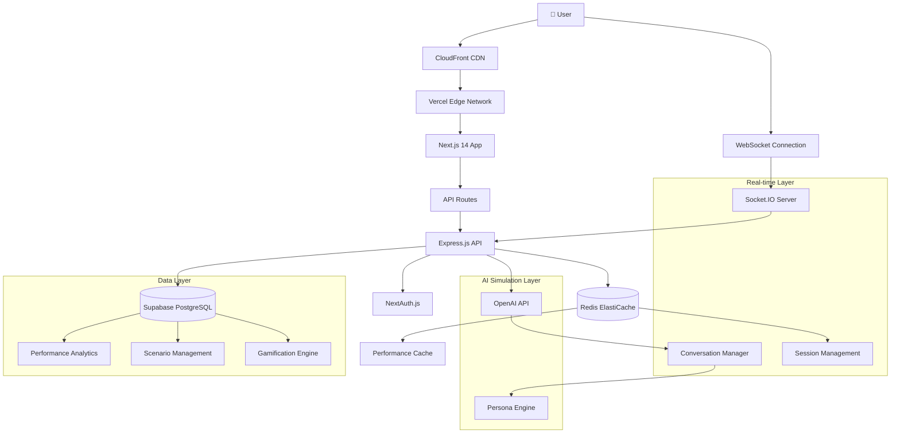

# Architecture Diagram

```mermaid
graph TB
    User[👤 User] --> CDN[CloudFront CDN]
    User --> WSS[WebSocket Connection]
    CDN --> Vercel[Vercel Edge Network]
    Vercel --> NextJS[Next.js 14 App]
    WSS --> SocketIO[Socket.IO Server]
    SocketIO --> Express[Express.js API]
    NextJS --> API[API Routes]
    API --> Express
    Express --> Auth[NextAuth.js]
    Express --> AI[OpenAI API]
    Express --> DB[(Supabase PostgreSQL)]
    Express --> Cache[(Redis ElastiCache)]
    AI --> ConversationMgr[Conversation Manager]
    ConversationMgr --> PersonaEngine[Persona Engine]
    DB --> Analytics[Performance Analytics]
    DB --> Scenarios[Scenario Management]
    DB --> Gamification[Gamification Engine]
    Cache --> Sessions[Session Management]
    Cache --> Performance[Performance Cache]

    subgraph "Real-time Layer"
        SocketIO
        Sessions
        ConversationMgr
    end

    subgraph "AI Simulation Layer"
        AI
        PersonaEngine
        ConversationMgr
    end

    subgraph "Data Layer"
        DB
        Analytics
        Scenarios
        Gamification
    end
```
