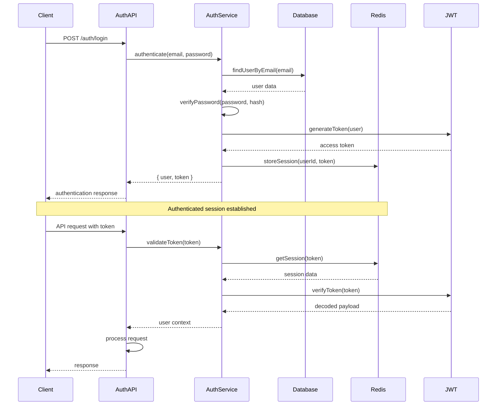

# Authentication and Authorization

## Auth Flow



## Auth Middleware

```typescript
// middleware/auth.ts
import { Request, Response, NextFunction } from 'express';
import jwt from 'jsonwebtoken';
import { redisClient } from '../config/redis';
import { userRepository } from '../repositories/userRepository';
import { logger } from '../utils/logger';

interface AuthenticatedRequest extends Request {
  user?: {
    id: string;
    email: string;
    level: number;
  };
}

export const authMiddleware = async (
  req: AuthenticatedRequest,
  res: Response,
  next: NextFunction
) => {
  try {
    const token = req.header('Authorization')?.replace('Bearer ', '');

    if (!token) {
      return res.status(401).json({
        error: 'Access denied. No token provided.',
      });
    }

    // Verify JWT token
    const decoded = jwt.verify(token, process.env.JWT_SECRET!) as any;

    // Check if session exists in Redis
    const sessionExists = await redisClient.exists(`session:${decoded.userId}`);
    if (!sessionExists) {
      return res.status(401).json({
        error: 'Session expired. Please login again.',
      });
    }

    // Get user from database
    const user = await userRepository.findById(decoded.userId);
    if (!user) {
      return res.status(401).json({
        error: 'User not found.',
      });
    }

    // Attach user to request
    req.user = {
      id: user.id,
      email: user.email,
      level: user.level,
    };

    next();
  } catch (error) {
    logger.error('Authentication error:', error);
    return res.status(401).json({
      error: 'Invalid token.',
    });
  }
};
```

---

This comprehensive architecture document provides the complete technical foundation for building the IT Helpdesk Simulator. The modular design supports scalability, maintainability, and the complex real-time interactions required for authentic learning experiences.
