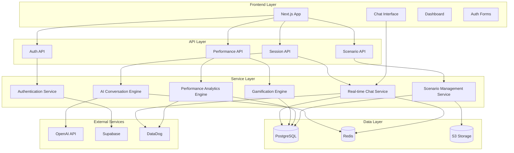

# Components Diagram

```mermaid
graph TB
    subgraph "Frontend Layer"
        NextJS[Next.js App]
        ChatUI[Chat Interface]
        Dashboard[Dashboard]
        AuthForms[Auth Forms]
    end

    subgraph "API Layer"
        AuthAPI[Auth API]
        ScenarioAPI[Scenario API]
        SessionAPI[Session API]
        PerformanceAPI[Performance API]
    end

    subgraph "Service Layer"
        AuthService[Authentication Service]
        AIEngine[AI Conversation Engine]
        ChatService[Real-time Chat Service]
        ScenarioMgr[Scenario Management Service]
        AnalyticsEngine[Performance Analytics Engine]
        GameEngine[Gamification Engine]
    end

    subgraph "Data Layer"
        PostgreSQL[(PostgreSQL)]
        Redis[(Redis)]
        S3[(S3 Storage)]
    end

    subgraph "External Services"
        OpenAI[OpenAI API]
        Supabase[Supabase]
        DataDog[DataDog]
    end

    NextJS --> AuthAPI
    NextJS --> ScenarioAPI
    NextJS --> SessionAPI
    NextJS --> PerformanceAPI
    ChatUI --> ChatService
    AuthAPI --> AuthService
    ScenarioAPI --> ScenarioMgr
    SessionAPI --> AIEngine
    SessionAPI --> ChatService
    PerformanceAPI --> AnalyticsEngine
    PerformanceAPI --> GameEngine
    AuthService --> Supabase
    AIEngine --> OpenAI
    ChatService --> Redis
    ScenarioMgr --> PostgreSQL
    AnalyticsEngine --> PostgreSQL
    GameEngine --> PostgreSQL
    AIEngine --> Redis
    ChatService --> PostgreSQL
    ScenarioMgr --> S3
    AnalyticsEngine --> DataDog
    ChatService --> DataDog
```
