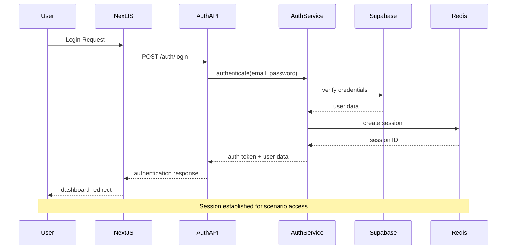
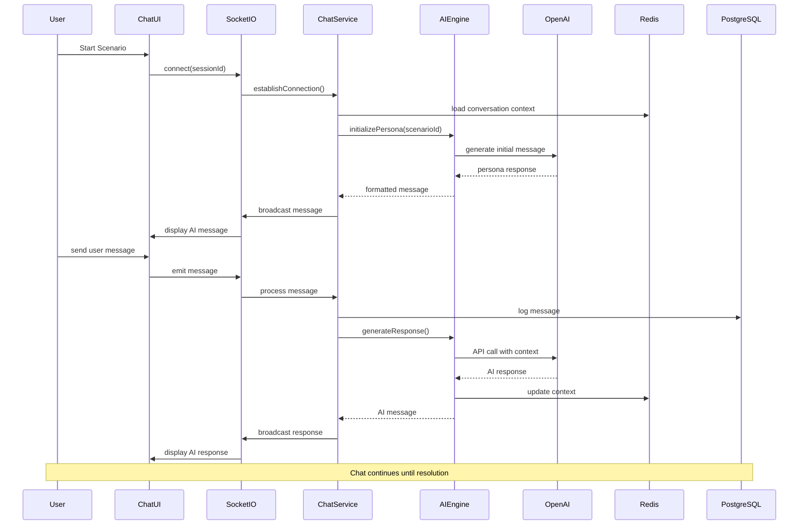
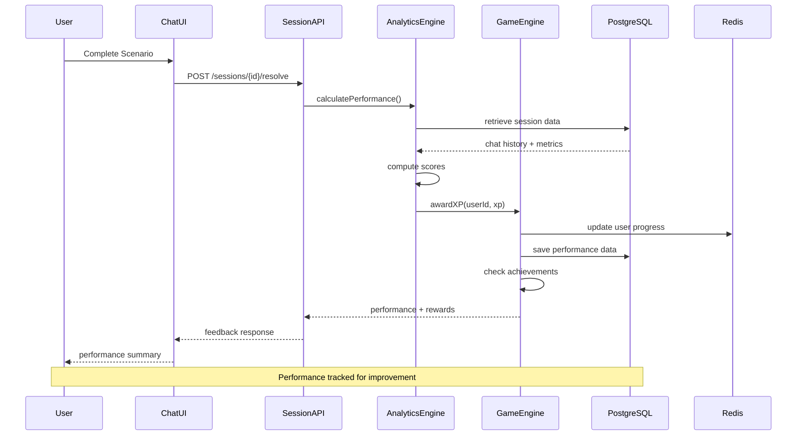

# Core Workflows

## User Authentication and Session Start

```mermaid
sequenceDiagram
    participant User
    participant NextJS
    participant AuthAPI
    participant AuthService
    participant Supabase
    participant Redis

    User->>NextJS: Login Request
    NextJS->>AuthAPI: POST /auth/login
    AuthAPI->>AuthService: authenticate(email, password)
    AuthService->>Supabase: verify credentials
    Supabase-->>AuthService: user data
    AuthService->>Redis: create session
    Redis-->>AuthService: session ID
    AuthService-->>AuthAPI: auth token + user data
    AuthAPI-->>NextJS: authentication response
    NextJS-->>User: dashboard redirect

    Note over User,Redis: Session established for scenario access
```

## Real-time Chat Scenario Flow

```mermaid
sequenceDiagram
    participant User
    participant ChatUI
    participant SocketIO
    participant ChatService
    participant AIEngine
    participant OpenAI
    participant Redis
    participant PostgreSQL

    User->>ChatUI: Start Scenario
    ChatUI->>SocketIO: connect(sessionId)
    SocketIO->>ChatService: establishConnection()
    ChatService->>Redis: load conversation context
    ChatService->>AIEngine: initializePersona(scenarioId)
    AIEngine->>OpenAI: generate initial message
    OpenAI-->>AIEngine: persona response
    AIEngine-->>ChatService: formatted message
    ChatService->>SocketIO: broadcast message
    SocketIO->>ChatUI: display AI message

    User->>ChatUI: send user message
    ChatUI->>SocketIO: emit message
    SocketIO->>ChatService: process message
    ChatService->>PostgreSQL: log message
    ChatService->>AIEngine: generateResponse()
    AIEngine->>OpenAI: API call with context
    OpenAI-->>AIEngine: AI response
    AIEngine->>Redis: update context
    AIEngine-->>ChatService: AI message
    ChatService->>SocketIO: broadcast response
    SocketIO->>ChatUI: display AI response

    Note over User,PostgreSQL: Chat continues until resolution
```

## Performance Assessment and Gamification

```mermaid
sequenceDiagram
    participant User
    participant ChatUI
    participant SessionAPI
    participant AnalyticsEngine
    participant GameEngine
    participant PostgreSQL
    participant Redis

    User->>ChatUI: Complete Scenario
    ChatUI->>SessionAPI: POST /sessions/{id}/resolve
    SessionAPI->>AnalyticsEngine: calculatePerformance()
    AnalyticsEngine->>PostgreSQL: retrieve session data
    PostgreSQL-->>AnalyticsEngine: chat history + metrics
    AnalyticsEngine->>AnalyticsEngine: compute scores
    AnalyticsEngine->>GameEngine: awardXP(userId, xp)
    GameEngine->>Redis: update user progress
    GameEngine->>PostgreSQL: save performance data
    GameEngine->>GameEngine: check achievements
    GameEngine-->>SessionAPI: performance + rewards
    SessionAPI-->>ChatUI: feedback response
    ChatUI-->>User: performance summary

    Note over User,PostgreSQL: Performance tracked for improvement
```
